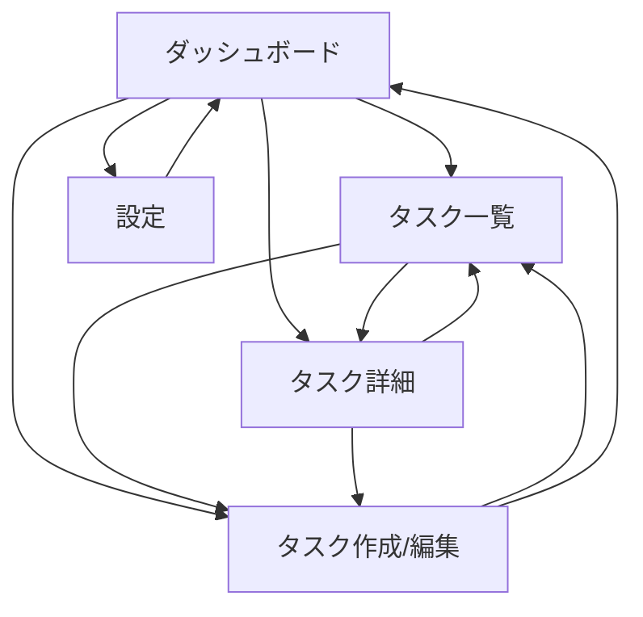

# Deadline Calender 実装具体化（無料優先 / ローカル完結）

## 1. 前提と採用スタック

- **実行環境**: Tauri v2（デスクトップアプリ化）
- **UI**: React + TypeScript + Vite
- **ローカルDB**: SQLite（`@tauri-apps/plugin-sql`）
- **通知**: Tauri Notification plugin（OSネイティブ通知）
- **バックエンド**: なし（完全ローカル）

> 目的: 「締切管理」と「PC通知」を、サーバ運用なし・月額0円で安定提供する。

---

## 2. 画面遷移図（MVP）



### 2.1 画面ごとの責務

1. **ダッシュボード**
   - 今日のタスク
   - 今週の締切
   - 期限切れ
   - 今日通知予定

2. **タスク一覧**
   - フィルタ: 未完了 / 完了 / 期限切れ
   - ソート: 締切順 / 優先度順 / 作成日順

3. **タスク作成/編集**
   - タイトル、説明、締切、優先度、ステータス
   - リマインド（何日前から / 何回 / 通知時刻 / 当日通知）
   - 通知予定プレビュー

4. **タスク詳細**
   - タスク情報表示
   - 予定通知一覧（pending / sent）
   - 完了切替・編集導線

5. **設定**
   - 通知権限確認
   - 既定リマインド設定
   - JSONエクスポート / インポート

---

## 3. DBスキーマ（SQLite）

```sql
PRAGMA foreign_keys = ON;

CREATE TABLE IF NOT EXISTS tasks (
  id INTEGER PRIMARY KEY AUTOINCREMENT,
  title TEXT NOT NULL,
  description TEXT DEFAULT '',
  due_at TEXT NOT NULL,                 -- ISO8601
  priority TEXT NOT NULL CHECK(priority IN ('low','medium','high')),
  status TEXT NOT NULL CHECK(status IN ('todo','doing','done')),
  created_at TEXT NOT NULL,
  updated_at TEXT NOT NULL
);

CREATE TABLE IF NOT EXISTS reminder_policies (
  id INTEGER PRIMARY KEY AUTOINCREMENT,
  task_id INTEGER NOT NULL UNIQUE,
  enabled INTEGER NOT NULL DEFAULT 1,   -- 0/1
  start_days_before INTEGER NOT NULL DEFAULT 7,
  remind_count INTEGER NOT NULL DEFAULT 3,
  remind_time TEXT NOT NULL DEFAULT '09:00',
  include_due_day INTEGER NOT NULL DEFAULT 1,
  custom_mode INTEGER NOT NULL DEFAULT 0,
  custom_offsets_json TEXT DEFAULT NULL, -- e.g. [7,3,1,0]
  created_at TEXT NOT NULL,
  updated_at TEXT NOT NULL,
  FOREIGN KEY(task_id) REFERENCES tasks(id) ON DELETE CASCADE
);

CREATE TABLE IF NOT EXISTS reminder_events (
  id INTEGER PRIMARY KEY AUTOINCREMENT,
  task_id INTEGER NOT NULL,
  scheduled_at TEXT NOT NULL,
  sent_at TEXT DEFAULT NULL,
  status TEXT NOT NULL CHECK(status IN ('pending','sent','skipped')),
  message TEXT NOT NULL,
  created_at TEXT NOT NULL,
  updated_at TEXT NOT NULL,
  FOREIGN KEY(task_id) REFERENCES tasks(id) ON DELETE CASCADE
);

CREATE INDEX IF NOT EXISTS idx_tasks_due_at ON tasks(due_at);
CREATE INDEX IF NOT EXISTS idx_tasks_status ON tasks(status);
CREATE INDEX IF NOT EXISTS idx_events_sched_status ON reminder_events(status, scheduled_at);
```

### 3.1 設計意図

- `task_id` を `reminder_policies` で **UNIQUE** にし、1タスク1ポリシーを保証。
- 通知判定を高速化するため `reminder_events(status, scheduled_at)` に複合インデックス。
- 通知は都度計算ではなく**前計算して保存**（`reminder_events`）し、定期チェックを軽量化。

---

## 4. 通知イベント生成仕様（MVP）

### 4.1 生成タイミング

- タスク新規作成時
- タスク更新時（締切・ポリシー変更）
- インポート時（再構築）

### 4.2 手順

1. 対象タスクの既存 `reminder_events` を削除
2. `start_days_before` から締切日までの範囲を作る
3. `remind_count` 回の通知点を均等配置（当日有無を反映）
4. `remind_time` を時刻として適用
5. `scheduled_at <= now` は作成しない（過去通知は除外）
6. 重複日時は1件に正規化
7. `status='pending'` で保存

### 4.3 1分間隔スケジューラ

- クエリ条件:
  - `status = 'pending'`
  - `scheduled_at <= now`
  - 関連 `task.status != 'done'`
- 実行:
  - OS通知表示
  - `sent_at = now`, `status = 'sent'` 更新
- 失敗時:
  - `status='pending'` のまま次回リトライ

---

## 5. フォルダ構成（実装しやすい最小構成）

```text
.
├─ src/
│  ├─ app/
│  │  ├─ routes.tsx
│  │  └─ providers.tsx
│  ├─ pages/
│  │  ├─ DashboardPage.tsx
│  │  ├─ TaskListPage.tsx
│  │  ├─ TaskDetailPage.tsx
│  │  ├─ TaskEditPage.tsx
│  │  └─ SettingsPage.tsx
│  ├─ features/
│  │  ├─ tasks/
│  │  │  ├─ components/
│  │  │  ├─ hooks/
│  │  │  ├─ schema.ts
│  │  │  └─ service.ts
│  │  └─ reminders/
│  │     ├─ calc.ts
│  │     ├─ scheduler.ts
│  │     └─ notification.ts
│  ├─ shared/
│  │  ├─ db/sqlite.ts
│  │  ├─ types/
│  │  └─ utils/
│  └─ main.tsx
├─ src-tauri/
│  ├─ tauri.conf.json
│  └─ capabilities/
│     └─ default.json
├─ docs/
│  └─ implementation_plan.md
└─ README.md
```

---

## 6. 実装優先順位（2スプリント想定）

### Sprint 1（MVP成立）

1. SQLite初期化 + 3テーブル作成
2. タスクCRUD
3. リマインドポリシー保存
4. 通知イベント生成
5. 1分スケジューラ + OS通知
6. ダッシュボード（今日/今週/期限切れ）

### Sprint 2（実用性向上）

1. 通知予定プレビューUI
2. JSONエクスポート/インポート
3. カスタムオフセット（`custom_offsets_json`）
4. 失敗時リカバリとログ表示

---

## 7. 受け入れ基準（MVP）

- タスクを作成すると、対応する通知イベントが生成される。
- アプリ起動中、通知時刻になるとPC通知が表示される。
- 完了タスクは通知対象外になる。
- 締切またはリマインド設定更新時、通知イベントが再生成される。
- 今日 / 今週 / 期限切れの3分類が正しく表示される。
- JSONでバックアップし、復元後に通知イベントが再構築される。
